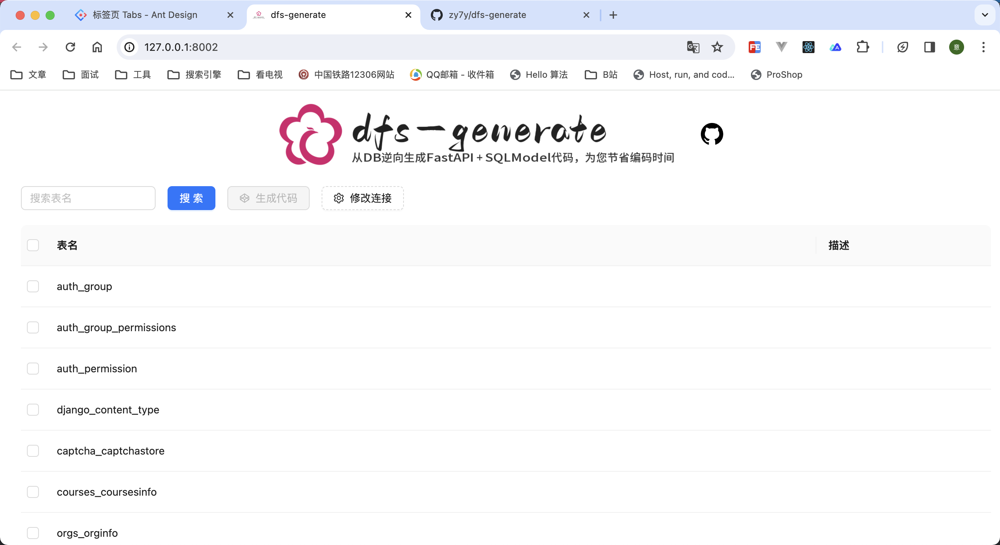
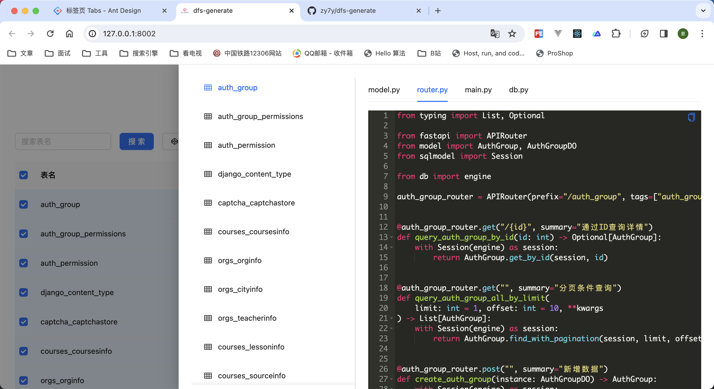
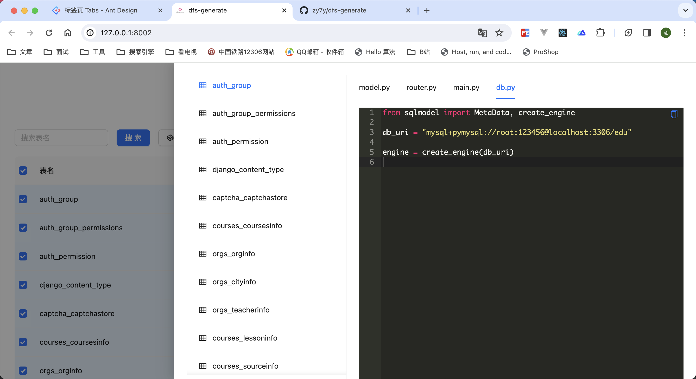

# dfs-generate
通过已有数据库表，生成FastAPI接口的工具项目,最终目的为FastAPI使用者，减少代码; 项目启发 Mybatis 逆向工程、[pdmaner](https://gitee.com/robergroup/pdmaner)

- d -> db 数据库
- f -> fastapi + uvicorn 接口服务
- s -> sqlmodel 数据实体、ORM模型

> 使用过程中有疑问、或其他宝贵意见 -> [issues](https://github.com/zy7y/dfs-generate/issues)，如果你对这个项目感兴趣，欢迎加入共同实现，
# 为什么不是其他
> 个人观点
1. 目前[Tortoise ORM](https://tortoise.github.io/)、 [Django Ninja](https://django-ninja.dev/)通过模型直接生成对应的Pydantic模型，均采用的 [动态创建模型](https://docs.pydantic.dev/latest/concepts/models/#dynamic-model-creation)，在Pycharm`.属性`无代码提示。
2. [SQLModel](https://github.com/tiangolo/sqlmodel/issues/654) 已有表生成模型，模型生成表，官方还未提供。
3. [fastapi-crudrouter](https://fastapi-crudrouter.awtkns.com/) 内部通过add_router方式注册路由，虽然代码减少了，但是灵活性变低了
4. 或该更多的使用表之间[逻辑关联](https://www.zhihu.com/question/20006142)

# 亮点
> 几乎没有亮点、代码质量也差
1. 项目本身Web服务、和生成的代码均使用 `Pydantic 2.x` 的`FastAPI`, `SQLModel` 版本
2. 将持续维护，欢迎一起加入。
3. 目前生成的代码非`async`，仅支持`MySQL` DB, 生成的代码分层不够清晰(还没抄到好的)，项目本身代码质量差（全是字符串format），生成的SQLModel 表模型部分类型待完善

# 上图





# 使用项目
> 项目本身语言版本 `Python3.8`
1. 拉取本项目
```shell
git clone https://github.com/zy7y/dfs-generate.git
```
2. 安装依赖
```shell
# 可跳过：安装并使用虚拟环境
python -m venv venv
# 进入虚拟环境
# win
venv\Script\activate
# mac / linux
source venv/bin/activate
```
```shell
# 安装依赖
pip install -r requirements.txt -i  https://mirrors.aliyun.com/pypi/simple/
```
3. 启动项目
```shell
uvicorn main:app --port 80
```
4. 浏览器访问
```shell
http://127.0.0.1:80
```

## Star History

<!-- STAR_HISTORY -->
<!-- /STAR_HISTORY -->
    


# Contributors

<!-- CONTRIBUTORS_SECTION -->
<!-- /CONTRIBUTORS_SECTION -->

