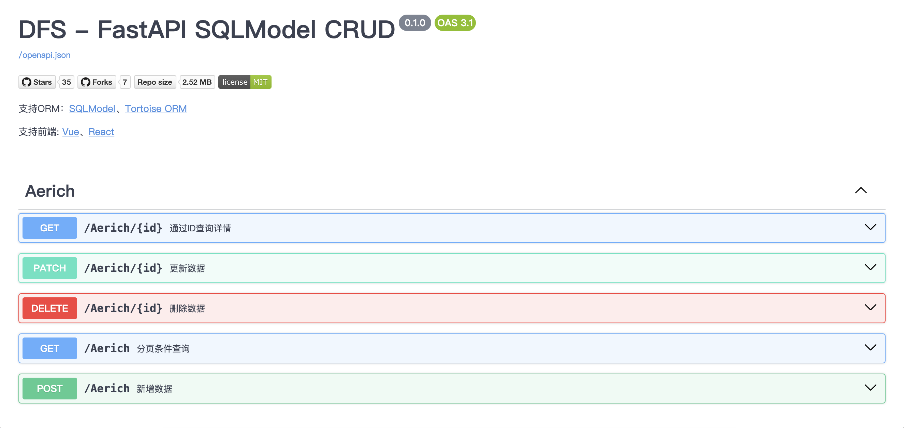
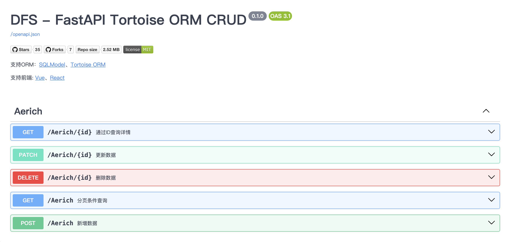

# dfs-generate
通过已有数据库表，生成FastAPI接口的工具项目,最终目的为FastAPI使用者，减少代码; 项目启发 Mybatis 逆向工程、[pdmaner](https://gitee.com/robergroup/pdmaner)

# 支持ORM
- [x] SQLModel
- [x] Tortoise ORM

# Generate Code
[FastAPI SQLModel MySQL](docs/sqlmodel)


[FastAPI Tortoise ORM MySQL](docs/tortoise-orm)


> 使用过程中有疑问、或其他宝贵意见 -> [issues](https://github.com/zy7y/dfs-generate/issues)，如果你对这个项目感兴趣，欢迎加入共同实现，

# 源码运行
<details>
<summary>查看详情</summary>

> 注意：开发使用环境 Node18.15 Python3.11，不低于该要求最佳。

## 1. 下载源码
```shell
git clone https://github.com/zy7y/dfs-generate.git
```

> 以下命令均在源码根目录执行
## 2. 前端
### 进入目录
```shell
cd web
```
### 安装依赖
```shell
npm i
```
### 打包编译
```shell
npm run build
```

## 3. 后端
### 虚拟环境（可选）
```shell
python -m venv venv

# windows 激活虚拟环境
venv\Scripts\activate

# mac 、linux 激活虚拟环境
source venv/bin/activate
```
### 安装依赖
```shell
pip install -r requirements.txt 
```
### 运行
```shell
python dfs_generate/server.py
```
### 访问
> 注意：端口8080，请确保该端口未被占用
```shell
http://127.0.0.1:8080
```
</details>

# [更新日志](/docs/CHANGELOG.md)

# Star History
<!-- STAR_HISTORY -->

[](https://star-history.com/#zy7y/dfs-generate&Date)

<!-- /STAR_HISTORY -->
    


<!-- CONTRIBUTORS_SECTION -->
<!-- /CONTRIBUTORS_SECTION -->

# 赞赏


